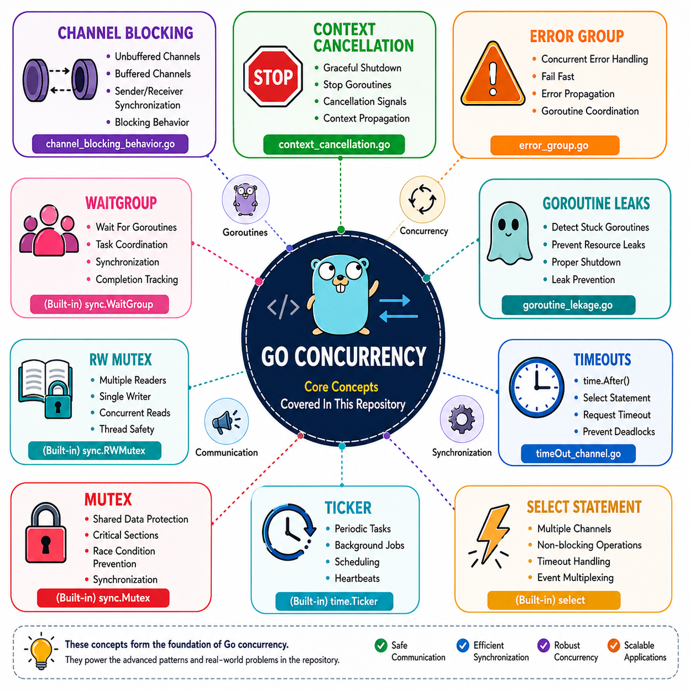

# Golang Concurrency

A curated collection of **Golang concurrency patterns, synchronization primitives, classical operating system problems, and real-world interview questions** frequently asked in backend and distributed systems interviews.

This repository is designed for engineers preparing for roles involving **Go, Distributed Systems, Cloud-Native Applications, Storage Systems, and Backend Engineering**, while also serving as a practical reference for learning concurrency fundamentals and production-ready concurrency patterns.

---

# Topics Covered


---

# Core Concepts



---

## Repository Structure

```text
Golang-Concurrency
│
├── main.go
├── go.mod
├── go.sum
├── README.md
│
├── .github
│   └── workflows
│       └── go.yml          # CI workflow for build validation
│
├── pkg
│   └── Common Interview Questions
│
└── pkg/core_concepts
    └── Concurrency Concepts
```

---

## Interview Preparation

This repository covers many commonly discussed concurrency topics found in backend, distributed systems, and Golang interviews, including:

* Goroutines & Channels
* Mutex & RWMutex
* Context Cancellation
* Error Propagation
* Worker Pools
* Producer Consumer Pattern
* Rate Limiting
* Pipeline Processing
* Thread-Safe Caching
* Task Scheduling
* Concurrent Web Crawling
* Synchronization Problems
* Goroutine Lifecycle Management

The examples range from **core concurrency concepts** to **classical synchronization problems** and **real-world system design patterns**, making it useful for interview preparation as well as practical learning.

---

## Author

**Avijit Bhattacharjee**

Backend Software Engineer | Golang | Kubernetes | Distributed Systems

GitHub: https://github.com/AvijitBhattacharjee
