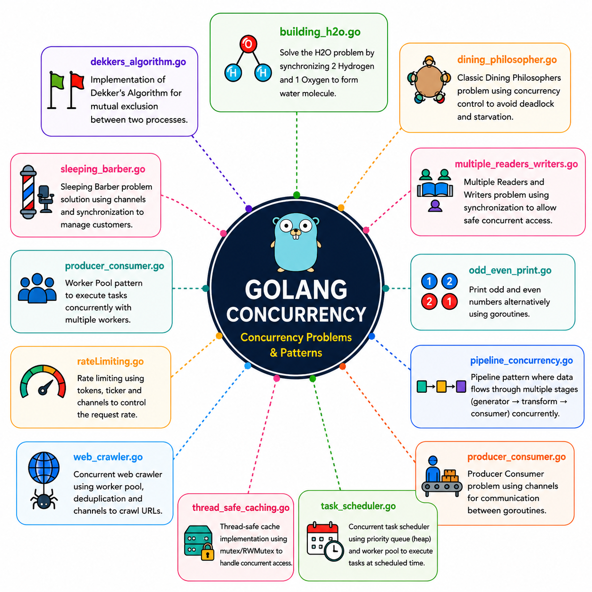

# Golang Concurrency

A collection of famous concurrency problems and patterns implemented in Go using:

- Goroutines
- Channels
- Mutexes
- WaitGroups
- Synchronization primitives

This repository is built for:

- Interview preparation
- Understanding Golang concurrency
- Practicing classic operating system synchronization problems
- Backend/distributed systems engineering preparation

---

# Topics Covered



---

# Repository Structure

```bash
Golang-Concurrency/
│
├── main.go
├── go.mod
├── go.sum
│
├── pkg/
│   ├── dining_philosopher.go
│   ├── sleeping_barber.go
│   └── producer_consumer.go
│
└── README.md
```

---

# Topics Left
1. Context Cancellation
2. Semaphore 
3. Fan-In/Fan-Out
4. Concurrent File Processing

# Author

Avijit Bhattacharjee

GitHub:
https://github.com/AvijitBhattacharjee